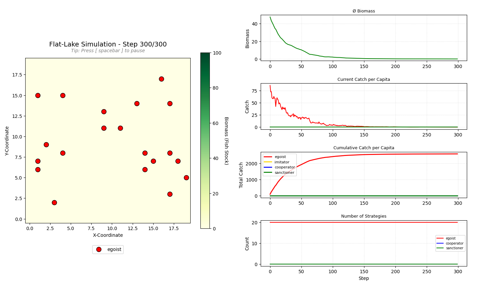
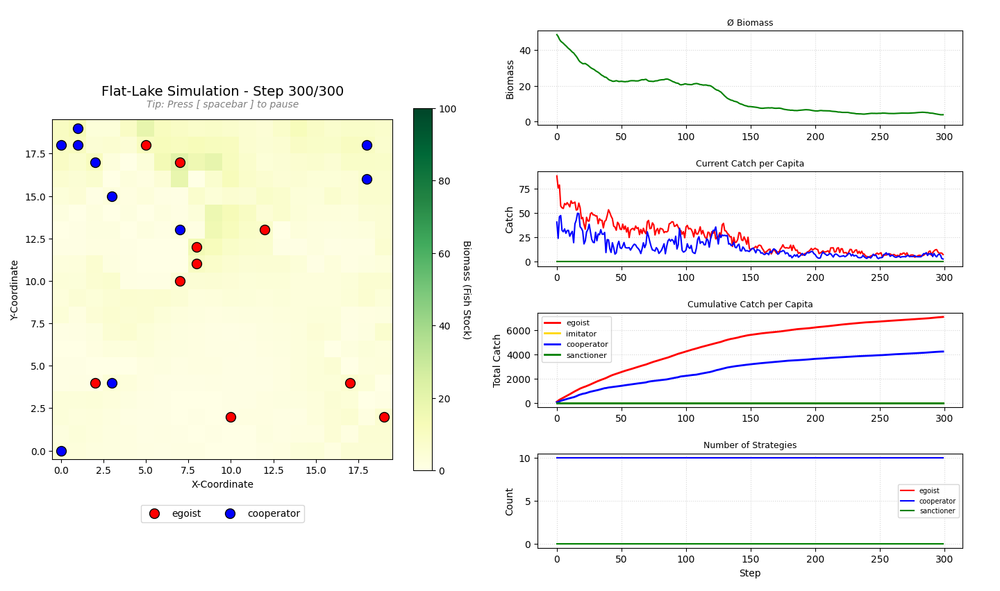
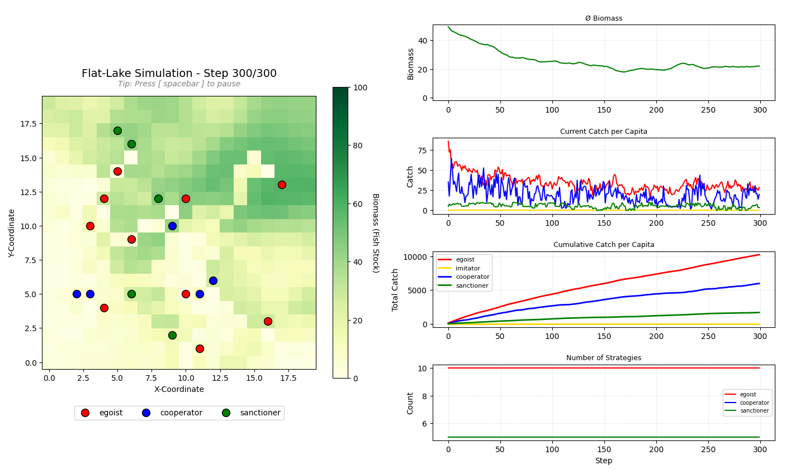
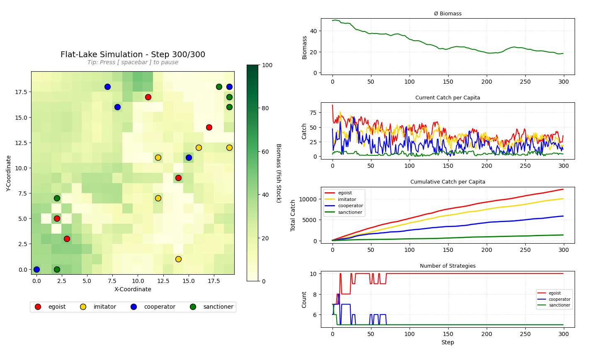
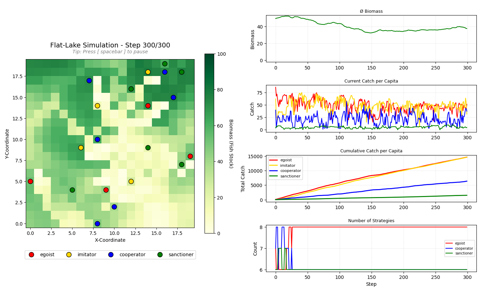
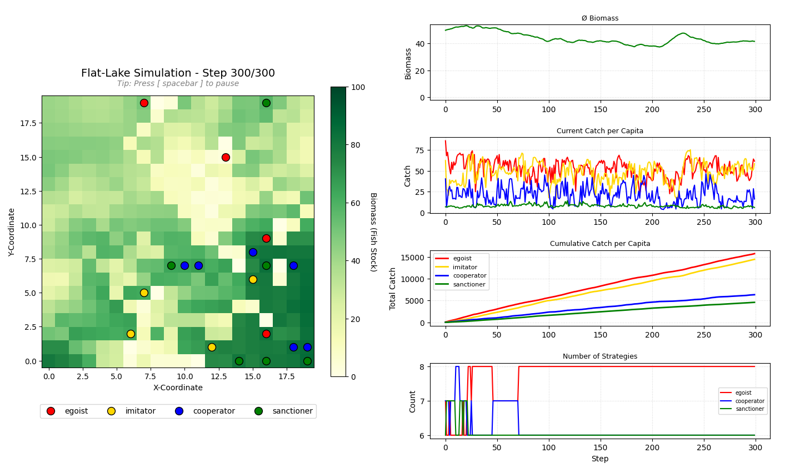

# Fischerei und Allmende: Eine agentenbasierte Simulation

## Abstract


## 1. Introduction
Das Problem der Fischerei und Allmende ist ein repräsentatives Beispiel der "Tragedy of the commons". Diese Theorie geht auf den britischen Wirtschaftsschriftsteller William Forster Lloyd zurück, der 1833 in seinen "Two lectures on the checks to population" postulierte, dass die Lebensmittelproduktion über kurz oder lang nicht mit der durch den stetigen Bevölkerungswachstum getriebene Nachfrage nach Lebensmittel nicht mehr mithalten können wird [[Q1]](#q1). Der Mikrobiologe und Ökologe Garret James Hardin griff die Theorie von Lloyd wieder auf und erweiterte die Thematik zur Bevölkerungsentwicklung mit der Problematik der Ressourcen(über)nutzung und der damit verbundenen Umweltzerstörung. Hardin hielt in seinem Artikel "The Tragedy of the commons" fest, dass, sobald einer Gesellschaft der uneingeschränkt Zugang zu einer Ressource gewährleistet würde, dies unausweichlich zu einem Ruin der Gemeinschaft führe, da jeder einzelne versuchen würde, seinen eigenen Ertrag zu maximieren [[Q2]](#q2). Howard Scott Gordon griff dieses Thema ebenso auf und verknüpfte es mit dem repräsentativen und auch hier behandelten, anschaulichen Beispiel der Fischerei, da Fische im Meer annähernd als Allgemeingut betrachtet werden können [[Q3]](#q3).
Die US-amerikanische Politikwissenschaftlerin Elinor Ostrom beleuchtet das Problem der Allmende jedoch unter einem anderen Blickwinkel und postuliert, dass Formen der Selbstorganisation und Kooperation der einzelnen Akteure einen Kollaps des Systems verhindern können. Instutitionelle Arrangements und Abkommen können dabei durch den Nutzen von lokalem Wissen eine potentielle Lösung des Allmendeproblems darstellen [[Q4]](#q4).
Das vorliegende agentenbasierte Modell soll nun die beiden vorgelegten Theorien von Hardin beziehungsweise Ostrom auf ihre Validität untersuchen. Es wird also ein besonderes Augenmerk darauf gelegt, unter welchen gesellschaftlichen Bedingungen sich ein Gleichgewicht durch lokale Kooperation einstellt oder das System kollabiert. Weiters wird überprüft, wie groß der Einfluss eines institutionellen Mechanismus in Form einer Bestrafung bei egoistischem Handeln ist beziehungsweise, in welcher Form Änderungen in der Systemdynamik durch einen regulativen Eingriff zu beobachten sind.


## 2. Method

### 2.1 Räumliche Struktur und ökologische Dynamik
Der See wird als 20x20 Gitter von Patch-Agenten modelliert, die durch ihre Biomasse, Kapazität und Wachstumsrate charakterisiert sind. Der See hat feste Grenzen, das heißt, dass der Gitterrand nicht mit dem gegenüberliegenden Rand benachbart ist. Das Gitter stellt demnach keinen Torus dar. Ein solches See-Gitter ließe sich beispielsweise als stark vereinfachte Darstellung der Nordsee als Quadrat mit einer Seitenlänge von ~500 km und einer daraus resultierenden Patch-Größe von 25 km x 25 km interpretieren.\
<br>
Die Biomasse in jedem Patch wird zu Beginn als Zufallswert zwischen 0 und der Kapazitätsgrenze von 100 initialisiert. In jedem Zeitschritt diffundiert die Biomasse in der Moore-Nachbarschaft (die 8 angrenzenden Patches) und regeneriert sich durch logistisches Wachstum. Die Diffusion erfolgt in drei Schritten. Im ersten Schritt wird ein Gitter für die neuen Biomassewerte erstellt, in dem vorerst die aktuellen Werte gespeichert werden.\
Im zweiten Schritt wird für jeden Patch im See-Gitter der Mittelwert der Biomasse in der Moore-Nachbarschaft berechnet, wobei Randpatches aufgrund der festen Grenzen weniger Nachbarn haben. Die eigene Biomasse des Patches wird bei der Berechnung der Mittelwerts nicht berücksichtigt. Der neue Biomassewert wird schließlich mit folgender Formel berechnet und in das neue Biomasse-Gitter übernommen:

```python
new_biomass = current_biomass + DIFFUSION_COEFFICIENT * (neighbor_average - current_biomass)

new_biomass_grid[y][x] = max(0.0, min(CAPACITY, new_biomass))
```

Die verwendete Formel bewirkt, dass die Biomasse von biomassereichen Patches zu biomassearmen Patches diffundiert. Der Diffusionskoeffizient von 0.1 bestimmt wie stark die Biomasse an das Mittel der Nachbarschaft angenähert wird. Anschließend wird sichergestellt, dass die Biomasse nicht negativ wird und die Kapazitätsgrenze nicht überschreitet. Im dritten Schritt wird die Biomasse aller Patches mit den neuen Biomassewerten aktualisiert. Dieser stufenweise Ansatz verhindert, dass die Reihenfolge der Patches die Diffusionsberechnung beeinflusst, da für alle Patches zunächst der neue Wert berechnet und zwischengespeichert wird, bevor die neuen Werte für alle Patches übernommen werden.\
<br>
Nach der Diffusion regeneriert sich die Biomasse in jedem Patch durch logistisches Wachstum gemäß der folgenden Formel: `biomass += growth_rate * biomass * (1 - (biomass / capacity))`.


### 2.2 Fischer-Agenten und Strategien
Die Fischer werden als Agenten modelliert, die durch ihre Position, Strategie, ihren aktuellen und kumulativen Fang sowie die Sanktionskosten charakterisiert sind. Die Fischer bewegen sich auf dem See-Gitter mit einer Wahrscheinlichkeit von 80 % auf den Patch in der Moore-Nachbarschaft, der die höchste Biomasse aufweist. Mit einer Wahrscheinlichkeit von 20% bewegen sie sich auf einen zufälligen benachbarten Patch. Die Fischer haben vier mögliche Strategien: Egoist, Kooperator, Sanktionierer und Imitator.\
<br>
Der **Egoist** fängt immer die gesamte Biomasse des Patches, auf dem er sich befindet. Die weiteren Strategien interagieren mit Fischern in ihrer Nachbarschaft, um ihr Fangverhalten zu bestimmen. Die Nachbarschaft ist als Sichtradius von 3 definiert.\
Der **Kooperator** fängt nachhaltig, nachhaltiger Fang ist in diesem Modell dynamisch über das logistische Wachstum der Biomasse definiert. So wird beim nachhaltigen Fangen die Biomasse berechnet, die im nächsten Schritt nachwachsen kann und mit einem Faktor `SUSTAINABLE_CATCH_MULTIPLIER` von 5 multipliziert um die nachhaltige Fangmenge zu bestimmen. Sind jedoch mehr als 50% der Fischer im Sichtradius des Kooperators Egoisten, so fängt er ebenfalls wie ein Egoist die gesamte Biomasse des Patches.\
Der **Sanktionierer** fängt in jedem Schritt nachhaltig. Nachdem alle Fischer gefangen haben, sanktionieren die Sanktionierer alle Nachbarn im Sichtradius, die um einen Faktor `SANCTION_THRESHOLD` von 1.2 den nachhaltigen Fang überschreiten. Der genaue Sanktionsmechanismus wird in Abschnitt 2.3 beschrieben.\
Der **Imitator** passt seine Strategie in jedem Schritt an den erfolgreichsten Fischer im Sichtradius an, wenn dieser erfolgreicher ist als der Imitator. Der erfolgreichste Fischer ist derjenige mit dem höchsten kumulativen Fang. Dabei ändern Imitatoren nur ihre aktuelle Strategie `current_strategy`, nicht ihre ursprüngliche Strategie `strategy`. Beim Initialisieren der Fischer wird die aktuelle Strategie der Imitatoren zufällig gewählt, die aktuelle Strategie der Kooperatoren, Sanktionierer und Egoisten entspricht immer ihrer ursprünglichen Strategie. Dadurch können Imitatoren immer als solche identifiziert werden und gleichzeitig dynamisch ihre Strategie anpassen.

### 2.3 Sanktionsmechanismus
Innerhalb des Sanktionsmechanismus wird in einem ersten Schritt der Umkreis des Sanktionierers nach anderen Fischern gescannt. Danach werden die gefundenen Fischer auf ihre Nachhaltigkeit anhand ihres Fischfanges überprüft. Fischen sie nicht nachhaltig, sondern verhalten sie sich egoistisch, so wird ihr Fang um die festgelegte `SANCTION_COST` vermindert. Der nachhaltige Fang ist hier nicht identisch mit dem nachhaltigen Fang der Kooperatoren und Sanktionierer. Während letzerer dynamisch über die aktuelle Biomasse und das logistische Wachstum des Patches berechnet wird, ist der nachhaltige Referenzfang für die Sanktionierung als fixer globaler Wert über Wachstumsrate und Kapazität definiert: `GROWTH_RATE * CAPACITY * 0.5`. Das liefert einen einheitlichen Referenzwert für alle Fischer unabhängig vom aktuellen Zustand der Patches. Ist zusätzlich der `DISTRIBUTION_SWEEP` aktiviert, so behält sich der Sanktionierer einen über die Variable `SANCTIONER_KEEP_RATIO` definierten Anteil der eingezogenen Sanktionskosten nicht nachhaltiger Fischer, während der Rest der eingezogenen Biomasse auf alle nachhaltig fischenden Akteure aufgeteilt wird. Andernfalls werden die Sanktionskosten nicht aufgeteilt, sondern schlichtweg nicht mehr beachtet.

### 2.4 Szenarien 
Zur Gegenüberstellung und Überprüfung der innerhalb der Introduction vorgestellten Theorien von Hardin beziehungsweise Ostrom wurden mehrere Szenarien mit verschiedenen Konstellationen der verschiedenen Fischerstrategien über das command-line-interface (CLI) durchgeführt. In Szenario 1 wurden auf den See 20 Egoisten gesetzt, um Hardins Theorie zum Systemkollaps bei freier Ressourcenzugänglichkeit zu überprüfen. In einem zweiten Szenario wurde Ostroms Theorie der lokalen Kooperation eingebaut, indem 10 Egoisten und 10 Kooperatoren auf dem See platziert wurden. In einem weiteren Szenario 3 wurde die Erweiterung der Ostrom'schen Theorie durch institutionelle Kontrollmechanismen in Form der Sanktionierer eingebaut. Die Rollenverteilung ist dabei 10 Egoisten, 5 Kooperatoren und 5 Sanktionierer. Im Szenario 4 wurde getestet, ob das Hinzufügen von 5 Imitatoren, die in der realen Gesellschaft mit den klassischen Mitläufern vergleichbar sind, anstatt von 5 der 10 Egoisten das Endergebnis der Biomassenentwicklung beeinflusst. Zudem wurde im Szenario 5 auch noch eine andere mögliche Strategieverteilung (4 Egoisten, 4 Imitatoren, 6 Kooperatoren, 6 Sanktionierer) implementiert. Im letzten, 6. Szenario wurde zusätzlich zur Rollenverteilung des Szenario 5 die Wirkung der Umverteilung (Distribution-Sweep) miteingebaut. 


## 3. Results
Szenario 1 zeigt anhand der exponentiell abfallenden Biomasse deutlich, dass Hardins Theorie des Systemkollapses bei einer frei verfügbaren Ressource unter der Annahme eines egoistischen Eigenverhaltens der Akteure durchaus zutrifft. Nach etwa 150 simulierten Zeitsteps ist die Biomasse im gesamten See nahezu ausgerottet. Aufgrund der egoistischen Fangstrategie kann sich diese auch im weiteren Simulationsverlauf nicht mehr erholen. Es ergibt sich also ein irreversibler Systemkollaps.
Bezieht man nun die Kooperatoren mit ein (Szenario 2), so ist der Biomassenverlauf zwar nicht mehr exponentiell abnehmend, aber dennoch nähert sie sich etwas zeitverzögert dem Nullpunkt an. Man kann also auch in diesem Fall von einem Systemkollaps sprechen. 

<table border="0" cellspacing="0" cellpadding="5" width="100%">
  <tr>
    <td align="center" width="50%"></td>
    <td align="center" width="50%"></td>
  </tr>
  <tr>
    <td align="center"><em>Abbildung 1: Szenario 1 - Kollaps durch Egoisten <br>
	(20 Egoisten)</em></td>
    <td align="center"><em>Abbildung 2: Szenario 2 - Egoisten und Kooperatoren <br>
	(10 Egoisten, 10 Kooperatoren)</em></td>
  </tr>
</table>

Erst unter Einbezug der Sanktionierer (Szenario 3) als institutionelle Kontrollmaßnahme schafft es das System, sich nach einer anfänglichen Einschwingungsphase zu stabilisieren. Das Szenario 4 mit den Imitatoren ähnelt dem Szenario 3 sehr, da die neu hinzugefügten Imitatoren zumeist als Egoist agieren. Das fünfte Szenario zeigt einen Gleichgewichtszustand, der nur durch lokale Überfischung oder lokales Nachwachsen leicht oszilliert. Das Szenario 6, das die soziale Umverteilung inkludiert, zeigt ein annähernd ähnliches Ergebnis in der Biomasse. Von der Umverteilung profitieren vor allem die Sanktionierer, da sie einen Anteil der eingezogenen Sanktionskosten behalten. Beim Fang der Kooperatoren ist hingegen trotz der Rückverteilung auf nachhaltige Fischer kein wesentlicher Vorteil gegenüber Szenario 5 ohne Umverteilung zu erkennen.

<table border="0" cellspacing="0" cellpadding="5">
  <tr>
    <td align="center" width="50%"></td>
    <td align="center" width="50%"></td>
  </tr>
  <tr>
    <td align="center"><em>Abbildung 3: Szenario 3 - Egoisten, Kooperatoren und Sanktionierer <br> 
	(10 Egoisten, 5 Kooperatoren, 5 Sanktionierer)</em></td>
    <td align="center"><em>Abbildung 4: Szenario 4 - Gleichmäßige Strategieverteilung <br>
	(5 Egoisten, 5 Kooperatoren, 5 Sanktionierer, 5 Imitatoren)</em></td>
  </tr>
</table>
<br>
<br>
<table border="0" cellspacing="0" cellpadding="5">
  <tr>
    <td align="center" width="50%"></td>
    <td align="center" width="50%"></td>
  </tr>
  <tr>
    <td align="center"><em>Abbildung 5: Szenario 5 - Gleichgewichtszustand <br>
	(4 Egoisten, 6 Kooperatoren, 6 Sanktionierer, 4 Imitatoren)</em></td>
    <td align="center"><em>Abbildung 6: Szenario 6 - Gleichgewicht mit Umverteilung <br>
	(4 Egoisten, 6 Kooperatoren, 6 Sanktionierer, 4 Imitatoren)</em></td>
  </tr>
</table>

Wirft man nun einen Blick auf die relativen, kumulativen Erträge, verteilt nach Fangstrategien, so ist aber dennoch deutlich, dass die Egoisten am profitablesten agieren. Konkurriert werden sie nur von den Imitatoren, die jedoch auch zumeist nach der egoistischen Fangstrategie fischen. Die Kooperatoren und die Sanktionierer steigen bei dieser ökonomischen Betrachtungsweise tendenziell schlechter aus, sorgen aber dafür, dass das System nicht kollabiert.


## 4. Discussion, Conclusion and Limitations


## References
<a id="q1"></a>Q1: Vgl. William Forster Lloyd: Two lectures on the checks to population. University of Oxford. 1833. S.7ff. [PDF](references_report/Two_Lectures_on_the_Checks_to_Population.pdf)\
<a id="q2"></a>Q2: Vgl. Garret James Hardin: The tragedy of the commons. Erschienen in: Science, New Series, Vol. 162, No. 3859. Dezember 1968. S.1243-1248. [PDF](references_report/The_tragedy_of_the_commons.pdf)\
<a id="q3"></a>Q3: Vgl. Howard Scott Gordon: The Economic Theory of a Common-Property Resource: The Fishery. Erschienen in: The Journal of Political Economy,   Vol. 62, No. 2. April 1954. S.124ff. [PDF](references_report/The_economic_theory_of_a_common_property_resource.pdf)\
<a id="q4"></a>Q4: Vgl. Elinor Ostrom: Governing the commons: The evolution of institutions for collective action. Cambridge University Press. 1990. S.14f. [PDF](references_report/Governing_the_commons.pdf)

## Appendix A: ODD
# 1. Overview
## 1.1 Purpose
Das Modell soll untersuchen, unter welchen Bedingungen eine gemeinsam genutzte Ressource kollabiert mit den kontrahierenden Thesen von Garrett Hardin 
(unausweichliche Übernutzung) und Elinor Ostrom (lokale Nutzungsordnung durch lokale Gemeinschaft).
- Einfluss des Verhaltens auf die Ressourcendynamik
- Kooperation unter Konkurrenz?
- räumliche Muster der Übernutzung?
- institutionelle Mechanismen als Schutz vor Übernutzung?
## 1.2 Entities, State Variables, Scales
Das Modell besteht aus 2 Ebenen: ein Gitter von See-Patches (ökologische Ebene) & eine Population von Fischer-Agenten (die soziale Ebene).
Die See-Patches sind definiert durch ihre Fischmasse, die Umweltkapazität und die Wachstumsrate der Fischmasse.
Die Agenten, also die Fischer sind definiert durch ihre aktuelle Position im Patch-Gitter, ihre Strategie, (Gewinnmaximierung, Imitation des erfolgreichsten Nachbarn, konditionelle Kooperation, oder Sanktionierung) und ihren Ertrag
- See (2D-Gitter aus Patches)
- Patch (Fischbestand):
	- Biomasse
	- Tragfähigkeit
	- Wachstumsrate
- Fischer (Agenten):
	- Position
	- Strategie
	- aktueller Fang
- 20 x 20 Gitter, diskrete Zeitschritte (300 Steps)
## 1.3 Process Overview & Scheduling
	1.	Fischbestand wächst und diffundiert
	2.	Fischer bewegt sich (Imitator wählt Strategie) und fängt
	3.	Sanktionen

# 2. Design Concepts
## 2.1  Basic Principles
Das Modell basiert auf zwei gegensätzlichen theoretischen Ansätzen:
- Hardin (1968): Individuelle Rationalität führt bei Gemeingut zur Ressourcenerschöpfung, da Nutzer den Ertrag privat einnehmen, die Kosten aber auf alle Nutzer verteilt werden.
- Ostrom (1990): Reale Gemeinschaften entwickeln Regeln, Grenzen, Sanktionen, Monitoring, die Kollaps verhindern können
## 2.2  Emergence
- Kollaps oder Stabilisierung des Fischbestands
- Räumliche Muster der Übernutzung
- Kooperationsnormen in Populationen 
## 2.3  Adaptation
Fischer können ihre Strategie in Abhängigkeit vom eigenen Erfolg und dem beobachteten Verhalten der Nachbarn anpassen.
Die Anpassungsmechanismen je nach Strategie:
- Imitationsagenten wechseln zur Strategie des erfolgreichsten beobachteten Nachbarn, wenn dessen Ertrag den eigenen übersteigt.
- Kooperationsagenten passen ihre Kooperationsbereitschaft basierend auf den Reputationswerten anderer an.
## 2.4  Objectives
Agenten verfolgen folgende Ziele, die sich je nach Strategie unterscheiden:
- Egoisten: Kurzfristige Maximierung des eigenen Fangertrags
- Imitatoren: Maximierung des eigenen Ertrags durch Beobachtung und Nachahmung
- Konditionale Kooperatoren: Langfristige Maximierung unter Berücksichtigung der Ressourcenverfügbarkeit
- Sanktionsagenten: Durchsetzung kollektiver Regeln, langfristige Nachhaltigkeit
## 2.5  Learning
Strategieadaption erfolgt durch Imitation (Beobachtung des Nachbarn) und bedingtes Reagieren auf Sanktionen. 
## 2.6  Prediction
Egoisten und Imitatoren handeln reaktiv ohne explizite Prognose. 
## 2.7  Sensing
Fischer können (je nach Strategie) folgende Informationen wahrnehmen:
- Fischbiomasse der aktuellen und benachbarten Zellen
- Strategie und letzter Fangertrag direkt benachbarter Fischer
Perfekte globale Information über den Gesamtbestand hat nur der Observer, nicht die Agenten.
## 2.8  Interaction
- Fischer–Patch: Fischentnahme durch Fischer reduziert die Biomasse des Patches direkt.
- Fischer–Fischer: Imitation & Sanktionierung
## 2.9  Stochasticity
	1.	Platzierung der Fischer auf dem Gitter
	2.	Initiale Strategiezuweisung der Agenten
	3.	Reihenfolge der Agentenaktivierung pro Schritt
	4.	Stochastische Komponente bei Bewegungen der Fischer
## 2.10  Collective
Es werden keine expliziten Gruppen oder Kollektive modelliert.
## 2.11  Observation
- Gesamtfischbestand und Verteilung der Biomasse (räumlich)
- Strategieverteilung der Fischer (Anteil jeder Strategie)
- Gesamtertrag und durchschnittlicher Ertrag je Strategie
- Relativer Ertrag pro Zeitschritt

# 3. Details
## 3.1  Initialization
Fisch-Patches:
Jede Zelle erhält eine initiale Biomasse in einem Intervall [0, 100],
dieser kann homogen oder räumlich heterogen (z.B. höher in der Mitte des Sees) verteilt sein.
Die Wachstumsrate ist für alle Patches identisch.
Fischer:
- Fischer werden zufällig auf dem Gitter platziert
- Strategien werden zugewiesen
- Initiale kumulative Erträge: 0
## 3.2  Eingabedaten
Das Modell benötigt keine externen Eingabedaten.
## 3.3 Submodels
### 3.3.1  Ökologisches Teilmodell: Logistisches Wachstum und Diffusion
Pro Zeitschritt wird die Biomasse jedes Patches gemäß der logistischen Wachstumsfunktion aktualisiert. 
Ein Diffusionsterm modelliert das passive Einwandern von Fischen aus benachbarten Patches: bestehend aus 
einem Diffusionskoeffizienten (z.B. 0,1) und dem Mittelwert der Biomasse der 8 Moore-Nachbarzellen
### 3.3.2  Übersicht der Strategien
- Egoist: Fischt bis zur lokalen Kapazitätsgrenze. Keine Berücksichtigung kollektiver Konsequenzen.
- Imitator: Beobachtet alle Fischer im Sichtradius, bestimmt den erfolgreichsten (höchster letzter Ertrag) 
und übernimmt mit gewisser Wahrscheinlichkeit dessen Strategie und Fangmenge.
- Konditionaler Kooperator: Berechnet eine nachhaltige Fangmenge basierend auf dem beobachteten Gesamtbestand uKooperation ist an die wahrgenommene Kooperationsbereitschaft der Nachbarn geknüpft
- Sanktionierer: Fischt nachhaltig und bestraft Fischer, die signifikant über der nachhaltigen Menge fangen.